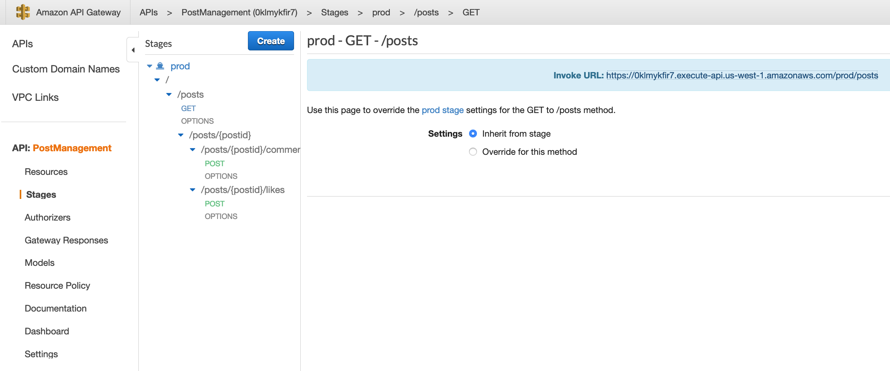

# Post Management 

Post Management provides capability to manage users Posts. 


Post Managment has these high level Workflows:

1. Create new Post. A post can have a text and optionally a video or a image
2. Get all post based on user preferences
3. Get all post based on users connections
4. Get all post based on time context (show latest first)
5. Create comment for a Post
6. Get Comments for a Post
7. Like a Post
8. Get Likes for a Post


## Setup


From inside the PostManagment folder run command

```
sam build

sam deploy

```

Wait for the deployment to complete

Go to AWS API Gateway Console and make note of API endpoint




Copy the link and open in new browser window, API should return a response similar to this:

```
[{"url":"https://videorepository-abhmish.s3-ap-southeast-1.amazonaws.com/video1.mp4","title":"Big Buck Bunny","likes":"200","author":"By Blender Foundation","id":"100","isVideo":true,"thumbnail":"images/BigBuckBunny.jpg"},{"url":"http://commondatastorage.googleapis.com/gtv-videos-bucket/sample/ElephantsDream.mp4","title":"The first Blender Open Movie from 2006","likes":"200","author":"By Blender Foundation","id":"101","isVideo":true,"thumbnail":"images/ElephantsDream.jpg"},{"url":"http://commondatastorage.googleapis.com/gtv-videos-bucket/sample/SubaruOutbackOnStreetAndDirt.mp4","title":"Subaru Outback On Street And Dirt","likes":"200","author":"By Garage419","id":"102","isVideo":true,"thumbnail":"images/SubaruOutbackOnStreetAndDirt.jpg"},{"url":"https://samvad-assets-abhmish.s3-us-west-1.amazonaws.com/assets/images/stock-photo-indian-man-holding-sickle-and-crops-498961396.jpg","title":"Sintel","likes":"200","author":"By Blender Foundation","id":"103","isVideo":false,"thumbnail":"images/Sintel.jpg"}]

```

The API currently returns mock data from 


End to end implementation will be done as part of the lab


### TODO:

Write API for finding Posts done by users
Write API to find count of posts, follows and followers of user [hint: Whats the best store to store this precalculated values?]


