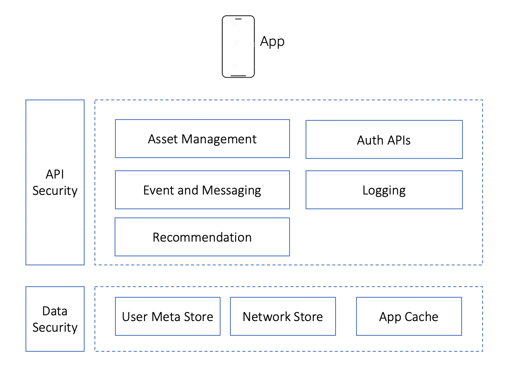

# Content Sharing App

This application is a sample content sharing app. Application allows you to share pics, videos and articles. You can like a content or comments on content. The application is enabled to give contextual recommendation to people. 

## High Level Use cases

1. Users can share their videos and pics in a secure way
2. Users can like, share and comment on a video or pic
3. Users can set preferences on topics they want to see content
4. Users are given content recommendations based on their usage patterns
5. Users can chat with others

##  High Level Architecture

The application is modelled as a **Hybrid Mobile application** built on **reactjs** and **ionic framework.**. Application backend is modelled as a microservices architecture. Microservices expose **http** and **socket** based APIs for consumption from application layer.


 

## Application features:

1. API Driven application backend
2. Data Security and Encription at rest
3. API Security
4. User Managment
5. Capability to store user's assets videos, articles and images
6. Content Recommendation based on preferences, user access patterns
7. DevOps


Application backend comprises of 4 Microservices APIs

1. **PostManagement**

Post Management is responsible for providing CRUD operations for application assets videos, images and articles.

[click for details](./API/PostManagement)


2. **CommunicationManagement**

Communication Management is responsible for providing email, push and sms based communication

[click for details](./API/CommunicationManagement)


3. **UserManagement**

User Management is responsible for providing CRUD operations for users, managing user preferences
[click for details](./API/UserManagement)


4. **NetworkManagement**

Network Management is responsible for tracking use access patterns, build social graph and generate recommendations for users

[click for details](./API/NetworkManagement)


## Application Setup

**Pre-requisite**

1. [Git](https://git-scm.com/book/en/v2/Getting-Started-Installing-Git)
2. [AWS Command Line Interface](https://aws.amazon.com/cli/)
3. [SAM Command Line Interface](https://docs.aws.amazon.com/serverless-application-model/latest/developerguide/serverless-sam-cli-install.html)
4. [NodeJS](https://nodejs.org/en/)
5. [Ionic](https://ionicframework.com/docs/intro/cli)


**Clone the files locally**

Replace __&lt;gitrepositoryurl>__ with repository url

```
git clone <gitrepositoryurl>
```

**Create S3 bucket to uplaod artefacts**

update &lt;alias> with your user alias

```

aws s3 mb s3://workshop-<alias> --region <awsregion>

```

**Update the SAM configuration template**

update values for &lt;AWSRegion> and &lt;AWSS3Bucket>. Updated values will look similar to below

```
s3_bucket = "workshop-<alias>"
region = "<awsregion>"

```

**Setup Base infra**

Use the _template.yaml_ at root folder to create the base infra needed for the application to work. The template sets up **Amazon Cognito User pool** and **Cloud 9 IDE**. 

Run the commands

```
sam build
sam deploy
```

Wait for the execution to complete. 

Next step is to setup individual services, go to [PostManagement](./API/PostManagement) folder


How to clone the repo?
git clone codecommit://<AWSUserProfile>@Ishare <folder name>

Also install codecommit helper tool https://docs.aws.amazon.com/codecommit/latest/userguide/setting-up-git-remote-codecommit.html

test-push susarika --> To be removed