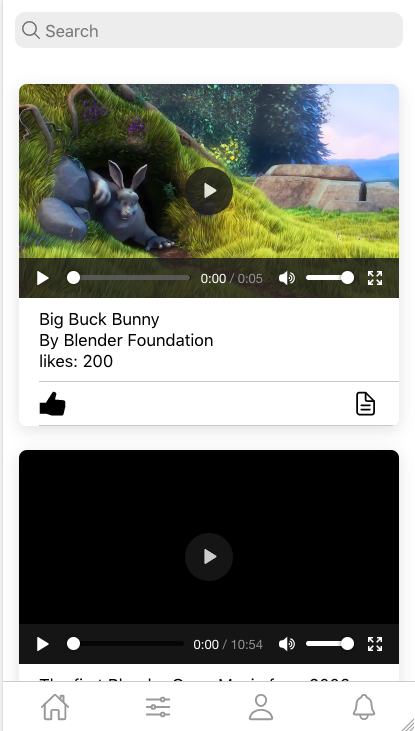
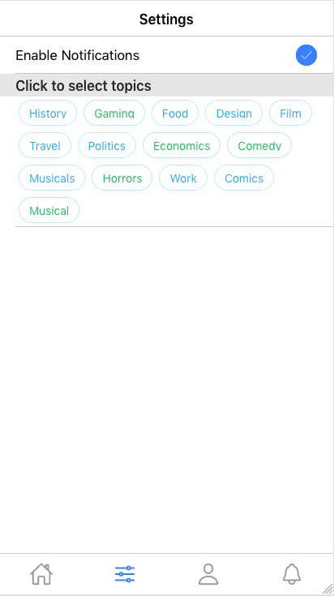
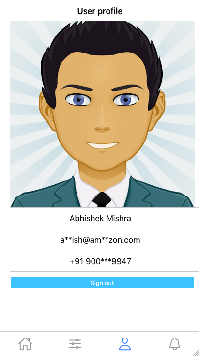
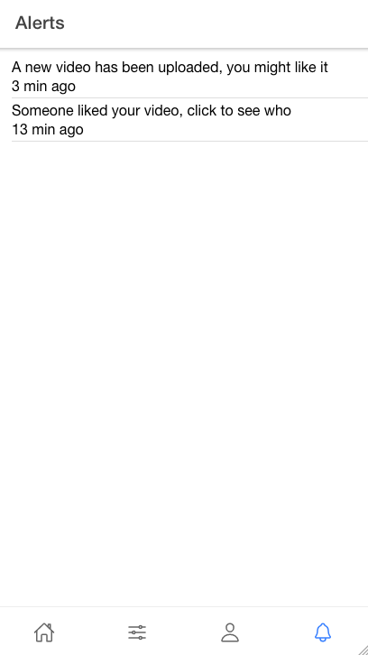
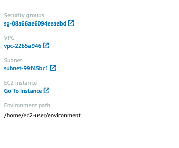
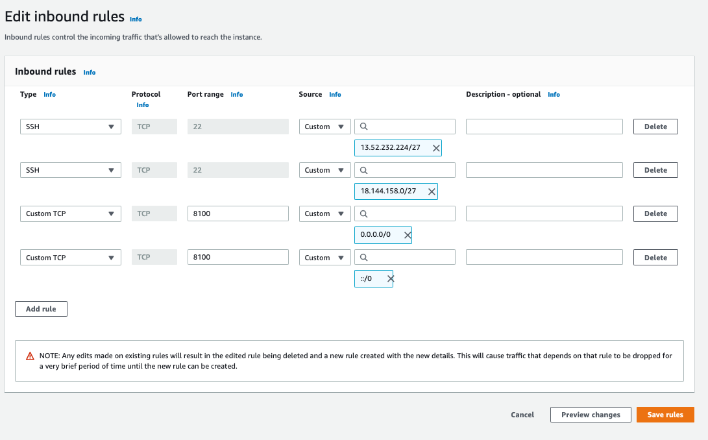
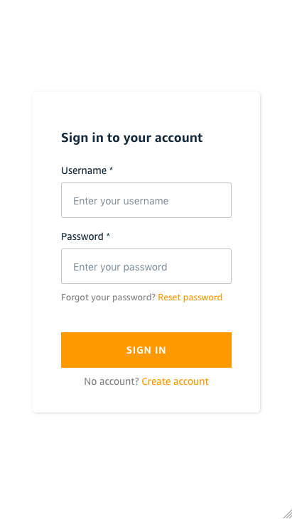

# Content Sharing App

This application is a sample content sharing app. Application allows you to share pics, videos and articles. You can like a content or comments on content. The application is enabled to give contextual recommendation to users. 

##  High Level Architecture

The application is modelled as a **Hybrid Mobile application** built on **reactjs** and **ionic framework.**. Application backend is modelled as a microservices architecture. Microservices expose **http** and **socket** based APIs for consumption from application layer.

## Application Overview










## Setup

**Pre-requisite**:

Setup the [PostManagment](../API/PostManagement) API before setting up the UI


**Setup UI**

We are going to setup the UI as web application. Open ___src/config.json___. Update values for **aws-region**, **userPoolId**, **userPoolWebClientId** and **Postmanagement** api endpoint. You will get these values from base [](../template.yaml) Output values

Once update the file should look similar to this


```
{
    "aws-region":"us-east-2",
    "auth": {
        "userPoolId": "us-east-2_dmdc0b95Z",
        "userPoolWebClientId": "3b97egruptkgjj94eb5sagj59m"
    },
    "api": {
        "postmanagement": "https://g4w8rvjfri.execute-api.us-east-2.amazonaws.com/prod"
    }
}

```


Install **ionic** and **react-scripts** runtime. Open terminal windows and go to directory the UI directory. Run Command

```
npm install -g ionic
npm install -g react-scripts
```

You have now configured the UI to interact with PostManagement API. Run commands 


```
ionic build
```

```
ionic serve
```

Make note of the **port number** on which the local server is running

Go to AWS Cloud9 Console. Select the environment and click on **View details**. 

Click on **Security Group** associated with the environment




Attach a new **inbound rule** to open **customer tcp port** on **port number** you made note of.




Click on **Go to instance** 


Make note of the **Public IPv4 address** address of the EC2 instance


Open a new browser tab/window and go to **http://&lt;EC2 Public IP>/&lt;Port Number>**. It will open the login page as shown below:





Click on create account to create a new User and Sign-In    
